# HAQDAAR v1 — System Architecture

> **Status: draft, staged, not merged.** Rebuilt 10 Sep 2026 against
> [[maps/wayfinder-map|Wayfinder Map rev 27]] and the closed tickets it indexes.
> **Rev 27 ratifies Groq's free tier** (overturning [[tickets/T11]] §5 *"on budget, not on
> argument"*) **and rev 26 moves the acceptance test to 14 Sep.** Where this rebuild still differs
> from the previous revision — the widening ladder, the caps, the frozen signatures, the audio
> pool — it is following a **closed ticket rev 27 never touched**. See
> [[01-CONTRADICTIONS|the contradiction audit]] §0.

**Precedence, unchanged from `docs/review`:** the map and the tickets are the source of truth.
Where this document disagrees with a closed ticket, **the ticket wins** and this document is fixed
in the same commit. [[tickets/T17]] holds the frozen interfaces; they are reproduced in
[[04-INTERFACES]] rather than paraphrased here, so there is exactly one place to check them.

---

## 1 · The shape, in one paragraph

**One Python 3.11 asyncio process, on Adarsh's laptop in Bengaluru, behind a fixed ngrok domain.**
A caller dials a number; the carrier fetches `/answer` over plain HTTP and gets back XML that opens
a bidirectional μ-law 8 kHz WebSocket to `/stream`. From there the call runs in four modules —
**Audio** hears and speaks, **Model** picks values off closed lists, **Engine** owns the loop and
the decisions, **Data** holds one frozen snapshot and appends one trace line per turn.

**The one rule the whole system rests on** ([[maps/wayfinder-map]], *How a language gets added*):

> **The system chooses from a list going in, and reads from a file going out. It never writes a
> sentence.**

That asymmetry is why the caller may code-mix freely while the system may not, why a mistranslation
can never become a false promise about money, and why the entire call loop is testable offline with
no phone line in existence.

---

## 2 · System context

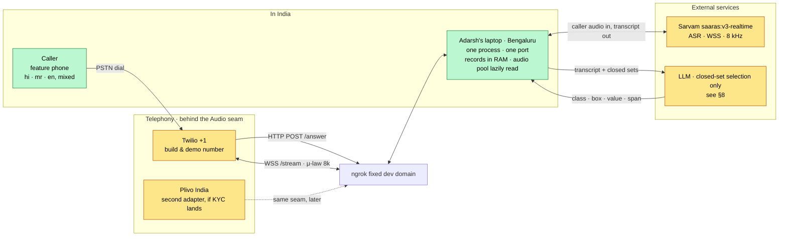

**Nothing is synthesised while a caller is on the line.** Every sentence the system can ever speak
exists as a rendered μ-law file before the call starts ([[tickets/T15]]). The TTS vendor, the
translator and the scraper are **build tools** and are never imported by the runtime.

---

## 3 · The four modules and three edges

[[tickets/T17]] ratified the roster with two corrections: **Model is Router only** (T15 and T06
between them deleted the Reader), and **the call loop — which no ticket had ever assigned — is
Engine's.**

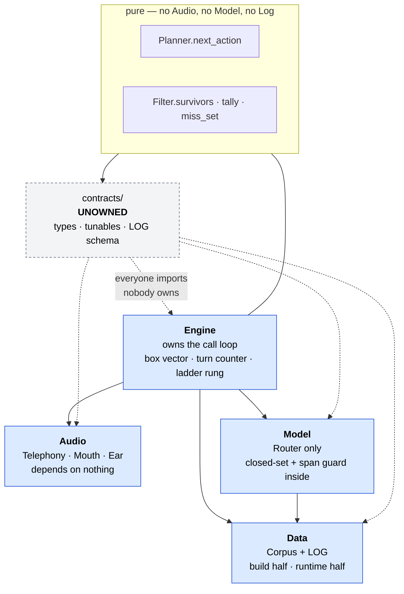

**Four modules, three edges, no cycles — and Audio depends on nothing.**

| Module | Owns | Never touches |
|---|---|---|
| **Audio** | the two sockets, both clocks, `say`/`repeat`/`clear` over marks, the DTMF race, the endpoint window | Engine, Model, Data. Knows no scheme, no box, no corpus |
| **Model** | one opener call, one call per question turn, closed-set validation and the span guard | Engine. Never writes a sentence, never raises, never returns out-of-set |
| **Engine** | the loop, the box vector, the turn counter, the ladder rung, every terminal decision, LOG-line assembly | sockets, providers, language. **Engine is language-blind** ([[tickets/T09]]) |
| **Data** | the snapshot (build + runtime), the mask table, the audio manifest, the trace file | the call. `Corpus` raises at load and never during a call |

Two structural consequences worth stating because they are easy to lose:

- **The span guard lives inside Model, not Engine** ([[tickets/T17]] §2). Model is the only module
  holding the transcript and the candidate value at the same moment, so validation runs *before*
  return and **Engine is structurally incapable of receiving an unvalidated value.** T11's guard
  stops being a discipline and becomes a type boundary.
- **Audio never terminates a call.** It surfaces `Silence(n)` and Engine decides
  ([[tickets/T17]] §2). This costs three trips through an in-process loop and buys three things:
  Audio needs no corpus knowledge, every SILENCE line [[tickets/T16]] wants is written where every
  other line is written, and the silence ladder becomes three Engine branches a test can drive with
  no socket.

**Collision is solved by file ownership, not branch discipline** ([[tickets/T17]] §3): every shared
type lives in unowned `contracts/`, after which no two owners ever need to edit the same file.
A PR touching two module directories is wrong by construction. **If the team is fewer than four,
merge Data+Engine and Audio+Model** — the first pair is offline and pure and shares the snapshot as
its whole world; the second is socket-bound and shares latency as its whole problem.

---

## 4 · Repository layout

```
haqdaar/                          ← git repo root
├── AGENTS.md · CLAUDE.md
├── brain/                        ← this vault, versioned beside the code
├── Makefile                      ← run · sim · test · demo-fixture · pipeline · smoke
├── haqdaar/
│   ├── server.py                 ← /answer · /stream · /health — wiring only
│   ├── sim.py                    ← console call, fake audio
│   ├── contracts/                ← UNOWNED. types.py · tunables.py · log_schema.py
│   ├── audio/                    ← owner A
│   │   ├── telephony/twilio.py   ← THE ONLY FILE THAT SAYS "twilio"
│   │   ├── ear.py · mouth.py · turn.py
│   ├── model/                    ← owner B · router.py · span_guard.py · prompts/
│   ├── engine/                   ← owner C · filter.py · planner.py · terminals.py · call.py
│   └── data/                     ← owner D
│       ├── corpus.py · log.py
│       └── pipeline/             ← build tools. NEVER imported by the runtime
├── fixtures/                     ← 5 schemes · 3 personas · 9 utterances · ~10 audio stubs
├── snapshots/<id>/               ← schemes.jsonl · masks.bin · vocab.json
│                                   templates.json · manifest.json
├── audio/<render_key>.ulaw       ← ONE FLAT POOL, shared across snapshots (gitignored)
├── logs/<call_id>.jsonl          ← gitignored
└── tests/
```

`filter.py`, `planner.py` and `terminals.py` import **nothing but `contracts/`**. That is the seam
that keeps [[tickets/T09]]'s purity claim honest after the loop moved into Engine, and it is what
makes [[tickets/T13]]'s dry-run an afternoon rather than a week.

---

## 5 · One call, dial to hangup

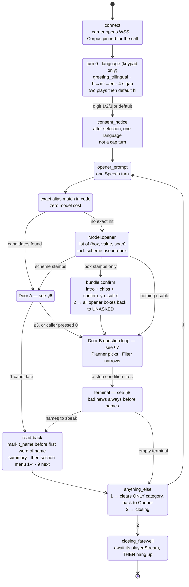


**Always on, at every state above:**

| Event | Effect | Costs a turn? |
|---|---|---|
| `#` | `repeat()` — replays the last sequence, marks re-fire | **no**, and no model call |
| `*` | re-plays `greeting_trilingual`, re-pins language, **clears nothing** | **no** |
| any keypress | resets the silence ladder to rung 0 | — |
| silence ladder | 6 s → replay the question · +6 s → `silence_presence` · +6 s → `closing_farewell` → hangup | **no** (SILENCE is not a cap turn) |
| noise | `vad.speech_start` fired but the final is empty or span-less → **NOISE** | **yes**, and counts toward the two-strike box drop |
| 2 model failures (non-consecutive) **or** 1 unrecovered ASR socket | `keypad_only_mode` for the rest of the call | — |
| 10-minute wall clock | `closing_farewell` → await mark → hangup | — |

`#` at turn 0 does **not** consume one of the two greeting plays, *"or a curious caller would be
defaulted into Hindi for pressing a key twice"* ([[tickets/T14]]).

---

## 6 · Door A — the opener, not a stage

[[tickets/T12]]'s central finding: **Door A is not a search stage in front of the router. It is the
opener**, with a `scheme` pseudo-box whose closed set is the corpus's scheme ids. There is no
routing decision, no second model call, and no extra turn — *"the doors are just which fields came
back."*

```mermaid
flowchart TD
    utt["opener utterance"] --> exact{"exact alias match<br/>in code, before the model"}
    exact -->|"hit"| count
    exact -->|"miss"| mdl["Model.opener → list of Stamps"]
    mdl --> count{"`scheme` candidate count"}
    mdl --> boxes["box stamps → bundle confirm"]

    count -->|"1"| read["<b>read back</b><br/>mark t_name before the name<br/>no echo-confirm — Door A is exempt"]
    count -->|"2"| pick["<b>one keypad turn</b><br/>door_a_option_1 + name<br/>door_a_option_2 + name<br/>door_a_option_none (press 0)"]
    count -->|"≥3"| down["door_a_downgrade_to_b<br/>seed Door B with what the name implies"]
    count -->|"0"| boxes

    pick -->|"1 or 2"| read
    pick -->|"0"| down
    boxes --> doorb["Door B questions"]
    down --> doorb

    classDef win fill:#bbf7d0,stroke:#15803d,color:#000
    class read win
```

- **The cap of 2 falls out of the data, not out of code.** The alias uniqueness gate drops any
  string appearing on ≥3 schemes (it is a category word — *"yojana"*, *"sarkari"*) and **keeps**
  one appearing on exactly 2 — *and those two schemes are the disambiguation pair.* No ambiguity
  list is authored or maintained anywhere ([[tickets/T12]], [[tickets/T07]]).
- **Door A is exempt from echo-confirm** — a deliberate narrowing of [[tickets/T11]]'s
  unconditional rule. *"The read-back is the confirmation."* A wrong box stamp is silent and
  compounds; a wrong scheme name is loud and self-correcting, and keypad interrupts everything.
- **Two clocks are stamped, one is judged.** `t_name` = end of the caller's utterance → first word
  of the scheme name. `t_end` = → last word of the `summary`. **The 20-second bar is judged on
  `t_name`.** Both ends are provider events — the origin is Sarvam's `vad.speech_end`, the stamp is
  the `playedStream` of a mark placed immediately before the name — so it is a measurement, not a
  local guess ([[tickets/T14]] branch 2b).
- **Door A is unavailable in keypad-only mode**, by the same cardinality rule that removes `state`:
  fifty scheme ids have no honest keypad menu. Not announced ([[tickets/T18]] §4).

---

## 7 · Door B — the narrowing loop

### 7.1 State: the box vector is the only state

[[tickets/T09]] overturned `survivors = survivors AND mask`. **Turn masks are retained, not folded.**

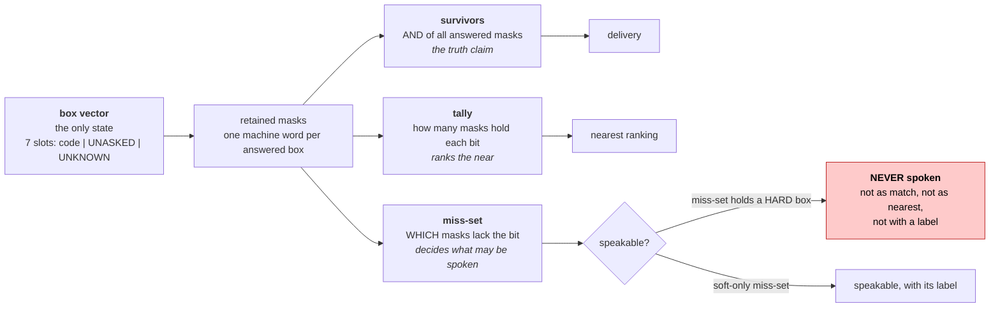

Cost: six machine words per call. **Survivors, tally and miss-set are always derived, never
maintained** — so a correction overwrites one box and everything re-derives, and there is no undo
stack because there is nothing to undo.

**`UNASKED` and `UNKNOWN` are the same instruction to the filter — no mask is appended.** They
differ only in the LOG and to the Planner, which must never re-ask an UNKNOWN box. **UNKNOWN always
widens, never narrows.** Both count as *not satisfied* for the speaking rule; the only difference
is that UNASKED is still askable ([[tickets/T11]] §4).

### 7.2 The box roster — hard means *the caller cannot be wrong*

[[tickets/T10]] D1. The axis is **fixed vs blurry, not legally barred**; the first cut (barred vs
mismatched) made six of seven boxes hard and left the widening ladder with one decorative rung.

| # | Box | Filled by | Class | Keypad? | Why |
|---|---|---|---|---|---|
| 0 | `category` | opener | soft | yes | a topic, not a fact |
| 1 | `state` | question | **hard** | **no — 36 values** | fixed; caller cannot be wrong |
| 2 | `gender` | question | **hard** | yes | fixed |
| 3 | `social_category` | question | **hard** | yes | fixed, documented, caller knows it |
| 4 | `age` | question | soft | yes | near-misses are real — 59 against a 60 pension |
| 5 | `income_band` | question | soft | yes | self-reported, fuzzy, changes |
| 6 | `occupation` | question | soft | yes | callers do more than one thing |

`scheme` is a **pseudo-box**: never in the filter table, never masked, never asked, never widened.
It appears in the box vector for LOG reconstruction only ([[tickets/T12]]).

### 7.3 Choosing the next question

**Ratified: minimax elimination ÷ expected turns** ([[tickets/T10]] D2). Score each unasked box by
its **worst** answer — the value leaving the most survivors — then divide by expected turns
(keypad 1, spoken 2). Lowest wins; ties break on snapshot order, so the LOG reproduces the call
exactly.

Information gain was rejected — not on cost, but because an expected-value score needs a caller
prior we do not have, and a uniform prior turns entropy into a proxy for *how many values a box
has*, so `state` (36) would outrank `gender` (2) on every turn of every call. *"Minimax puts a
guarantee in the LOG instead of an expectation: this question was chosen because it cuts at least
47 schemes whatever they say."*

**No mandatory questions.** [[tickets/T10]] D3 overturned *"state is always asked first"* and moved
the guarantee to a **speaking rule**: *a scheme non-`ANY` on an unasked hard box may not be spoken.*
Same shape as T09's never-speak rule, so no new machinery — and it closes the hole without spending
four turns up front.

> **v1 note — settled.** Minimax ships on **day one**. Ratified by Adarsh, **10 Sep 2026**
> ([[09-DECISION-LOG]] D3): rev 26's *"every feature present in its simplest form"* means the
> ratified feature simplified, not replaced, and minimax is ~15 lines over a `Filter` that already
> exists. **The fixed hard-boxes-first order is withdrawn** — it is no longer a stand-in, a fallback
> or a deviation, and no document may present it as the design. The `Widen` branch of
> `Planner.next_action` is likewise **not** optional: it is a frozen signature and a pass/fail
> condition ([[01-CONTRADICTIONS]] §1.2).

### 7.4 Stopping — four conditions, two counters

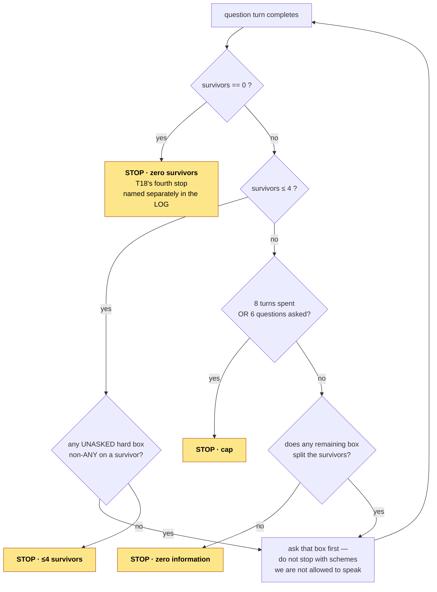

**Two counters, not one** ([[tickets/T10]] D4): **8 turns** spent, with a **hard wall at 6
questions** regardless of turn count. A keypad box costs 1 turn, a spoken box 2, and the opener
costs 2 if it fills anything and 1 if it fills nothing. Turn 0 is a turn that fills no box and
**does not count against the cap** — *"the cap is a predicate on the counter, not a claim that
every line is a cap turn"* ([[tickets/T24]] §5).

**Stop at 1 survivor and speak it.** Do not widen upward to manufacture a second — the bar's
"2–4 named schemes" is a delivery shape, not a floor ([[tickets/T10]] D4, [[tickets/T04]] branch 3).

The 8 is *"the one number in this ticket with no derivation behind it"* — named as the dial to turn
if the demo runs long, and it lives in `contracts/tunables.py` where it changes with no ceremony.

---

## 8 · Terminals — bad news before names, always

Two things are often conflated and must not be. **How the survivor set was obtained** (directly, or
after widening, or not at all) is a different question from **how many get spoken**
([[tickets/T10]] D7 supplies the second; [[tickets/T18]] §2 the first).

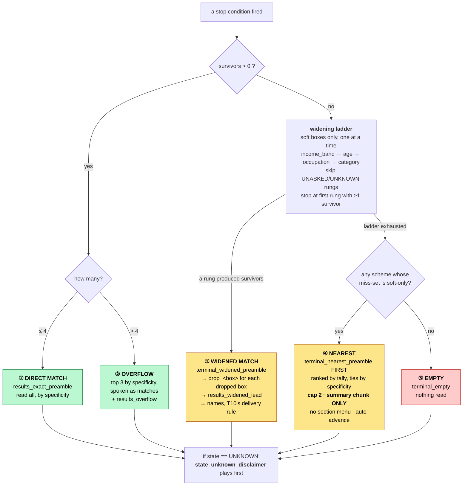

### The wording lock — an ordering rule, not a phrasing

> **In every non-exact terminal the qualifying clause is spoken *before* the scheme names, never
> after.** A caller who hangs up mid-line must hang up having heard the disclaimer rather than the
> promise. ([[tickets/T18]] §2)

This is asserted **at build time against the `say(sequence)` order**, and it survives machine
translation because **it is a property of order, not of words** — which matters precisely because
[[tickets/T08]] leaves no human between a translated eligibility claim and a citizen.

- **A widened match is a real match on a stated-smaller set of boxes** and is spoken as one.
  **A nearest is not a match at all** and must never borrow the widened wording. *This distinction
  is the whole of T18.*
- **Every dropped box is named, never summarised.** *"Some of what you told me"* is the softening
  that lets a caller believe more was matched than was.
- **Nearest reads `summary` only, with no keypad section offers** — *"offering to read the
  eligibility section of a scheme just declared a non-match invites the caller to treat it as one."*
- **Two is a restraint number, not a delivery shape.** If only one passes the gate, speak one.
- **No external phone number, helpline or website in any spoken line.** Nothing in the design
  verifies such a claim and [[tickets/T08]] staffs no verifier. Recorded as the largest piece of
  unrealised value in the fallback path — *it needs a source, not a sentence.*
- **No line in any terminal contains** "eligible", "qualify", "entitled", "you will get",
  "you can get", or पात्र / हकदार / मिलेगा / मिळेल — in any language, enforced by gate 4 (§10).

**Widening can never reintroduce a hard-box violation**, by construction: only soft boxes are ever
dropped, and the widened set still passes the speaking rule.

---

## 9 · The turn — two clocks, and the first complete input wins

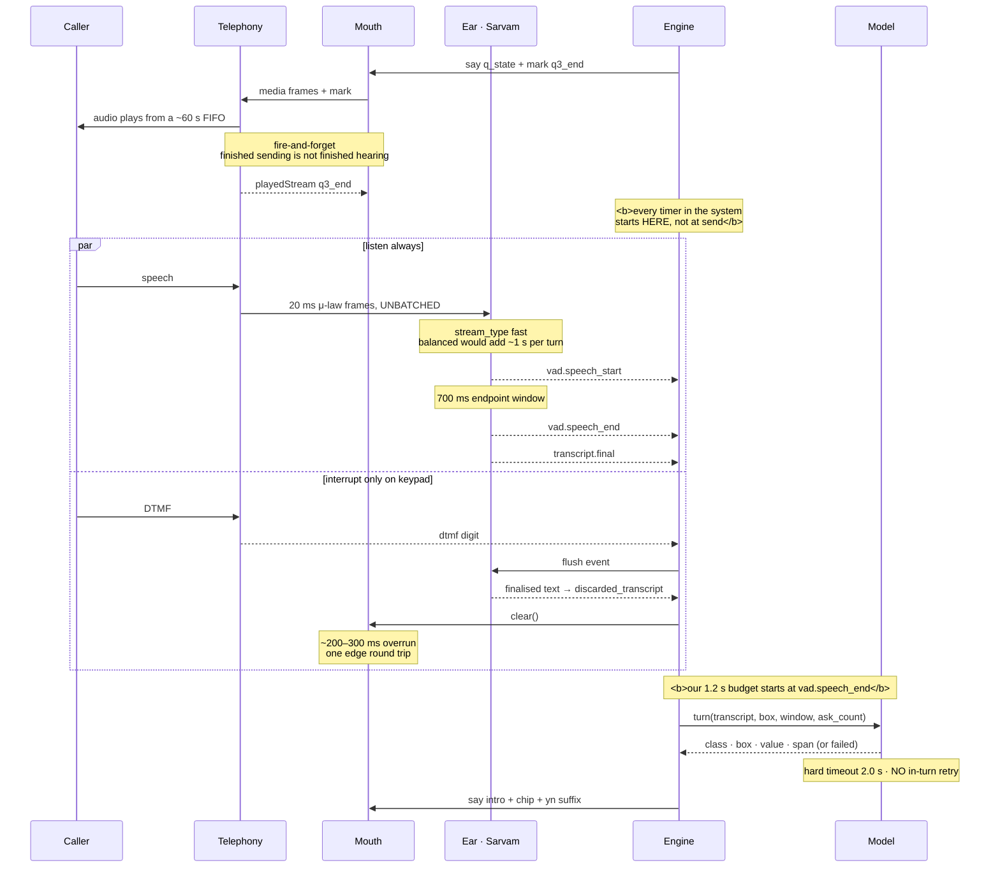

**The turn closes on the first *complete* input** ([[tickets/T14]] branch 5):

> **A keypress is complete on arrival. Speech is complete only at endpoint.**

This overturned *"audio beats DTMF"*, and the overturn is arithmetic rather than taste: *audio wins*
would require **holding every keypress** for the endpoint window to see whether speech follows —
which makes T10's *keypad costs 1 turn, spoken costs 2* false on every turn of every call, and the
keypad preference that T10, T11, T18 and T24 all lean on a fiction.

**Speech barge-in is designed, costed and switched off** — one flag. The trigger exists (Sarvam
emits `vad.speech_start`), but a false fire on 8 kHz household audio costs the caller the question,
while a true fire saves ~2 s of a short prompt: *the asymmetry runs the wrong way and the corpus is
noisy.* Replaced by **listen always, interrupt only on keypad** — `audioTrack="inbound"` means our
own audio is never on the transcribed leg, so the eager caller loses nothing; we simply decline to
stop talking. `#` is what makes that affordable.

**The budget** ([[tickets/T14]] branch 1), from `vad.speech_end` to first byte on the wire:

| Stage | Budget |
|---|---|
| `transcript.final` after `speech_end` | 150–300 ms |
| Model — closed-set pick, ~30 tokens out | 300–500 ms |
| Engine — one AND instruction | ~0 |
| Mouth — cache read, no synthesis | ~50 ms |
| Network to the carrier edge | 50–100 ms |
| **Total** | **≤ 1.2 s** (felt gap ~1.9 s including the endpoint window) |

**Sarvam config, ratified:** `endpointing=vad` · `stream_type="fast"` · `silence_duration_ms=700` ·
`min_speech_duration_ms=250` · `mode="codemix"` (always, all three pins) · `audioTrack="inbound"`.
Carrier frames are **forwarded unbatched** — *"the largest single saving in the chain, and it costs
nothing"*, because the 500–1000 ms chunking that dominates every published Sarvam latency budget is
a client-library artifact we do not inherit by writing our own client.

### Failure ladders — three, and they must not be muddled

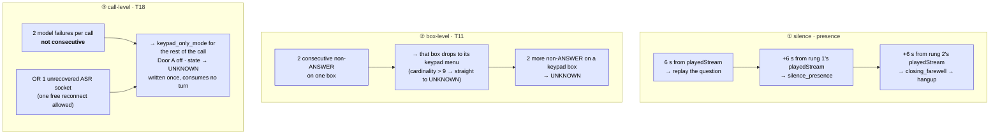

- **An UNCLEAR is not a failure.** It is a successful model turn reporting that it could not hear,
  and it belongs to ladder ②. Counting it in ③ *"would drop healthy calls on a noisy line."*
- **A failure** is any turn producing no usable model output: the 2.0 s timeout, a transport error,
  malformed output, an out-of-set value caught by code, or a span-guard drop. Because Model never
  raises, these surface as a typed return and the counter lives in Engine's loop.
- **Keypad-only is a mode, not a terminal state** — the call continues and reaches an ordinary
  terminal, and [[tickets/T04]] scores that a **pass**. *This corrects [[tickets/T16]].*
- **Keypad-only completes a whole call, traced end to end.** The binding worst case is a drop at
  turn 1 with an empty box vector: five askable boxes at keypad cost 1 = **5 turns against a cap
  of 8. It fits.**
- **One consequence must be spoken rather than silently applied:** in keypad-only, `state` has 36
  values and no honest menu, so it goes to UNKNOWN, so **only schemes `ANY` on `state` can be
  spoken.** That is correct, but it is an exclusion the caller would never hear about — hence
  `state_unknown_disclaimer` at the terminal.
- **A dead carrier socket is a dead call, not a degraded one.** `keepCallAlive="false"` ends it, no
  closing line is written, and [[tickets/T04]] correctly scores it a fail. This is the one T14
  ruling marked **ratify-on-hardware** — confirm on the first real call.

### The model-call budget — the shape rev 27 buys with a free tier

**Map rev 27 ratified Groq's free tier over [[tickets/T11]]'s paid Gemini, on budget and not on
argument**, and it did so by changing *how often the model is called* rather than by hoping the
limit would not bite: *"spend fewer model calls, not pretend the limit away."* That is an
architectural constraint, so it belongs here and not in a config file.

| Rule | Consequence |
|---|---|
| **The model is called at exactly two moments: the opener, and spoken `state`** | A typical call makes **one to three model calls.** Every other box is keypad, which is [[tickets/T10]]'s cheaper path anyway (1 turn, not 2) |
| **Exact alias match runs in code before `Model.opener`** ([[tickets/T12]]'s first search) | A cleanly named scheme — the Door A happy path, and the one the 20 s clock is measured on — costs **zero** model calls and zero model latency |
| **A 429 is a model failure under [[tickets/T18]]** | It joins the timeout, transport error, malformed output, out-of-set value and span drop in ladder ③. Two per call → keypad-only, which completes the call. **The free tier's worst case is a slower call, never a dead one** |
| **No in-turn retry** ([[tickets/T14]]) | A retry inside a 2.0 s budget spends the caller's silence twice and cannot beat the ladder |
| **The system prompt is byte-identical across calls** | Provider-side caching can apply, and the prompt is one reviewable artifact |
| **The model id is a tunable**, chosen by a **30-utterance bake-off at build** | `tunables.py`, [[06-BUILD-PLAN]] Step 14 — a provider swap is a line, not a redesign, because [[tickets/T11]]'s three-field contract, span guard and closed sets are untouched by rev 27 |
| **Pipeline model calls are throttled and cached to disk** | The corpus pass and the runtime share an org-wide limit; a re-run must not spend it |

**Two consequences to hold in view.** *One caller at a time* is a named, accepted risk — measured
in [[06-BUILD-PLAN]] Step 19 and **announced before judging, not discovered during it.** And
[[tickets/T14]]'s **300–500 ms** model-call figure was measured against Gemini Flash-Lite: it is now
**unverified**, and the 1.2 s response budget above rests on it. Step 14's bake-off reports latency
alongside accuracy; if the chosen Groq model misses, **the second clock moves, not the provider.**

---

## 10 · Data — the snapshot, the gates, the trace

Full field-level detail lives in [[05-DATA-CONTRACT]]; this section is the shape only.

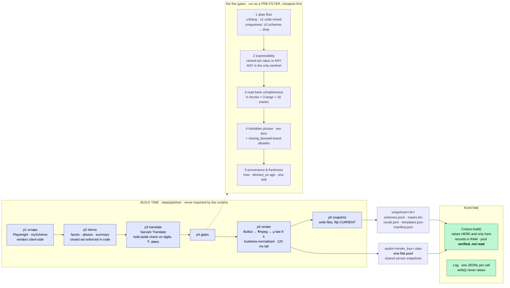

**`render_key = sha256(text ‖ lang ‖ voice_id ‖ tts_model ‖ 8000)`** — frozen verbatim
([[tickets/T15]], [[tickets/T17]]). Text alone would be wrong: *"a voice change would silently make
every cached caller hear last month's read-back."* The key is the whole render contract, which is
what makes a vendor swap **a re-render, not a redesign**.

### 10.1 · Audio storage — one flat pool, three tiers, read lazily

**The problem, stated honestly.** [[tickets/T15]] sized the pool at ~200 MB for the 100-scheme demo
corpus and concluded it *"fits in RAM"*, and [[tickets/T17]] froze the language choice partly on
that sentence. **The conclusion is correct and the reasoning does not scale.** Scheme chunks are
`6 × schemes × 3 langs`, which is **linear in the corpus**: at national scale (~2,500 schemes) the
pool is **~4.5 GB**, and a design whose boot step is *"read the whole pool into memory"* stops being
a demo host and starts being a machine requirement.

**What is actually frozen, and why nothing here breaks it.** `Corpus.audio()` and
`Corpus.chunks()` return a **`RenderKey` — a name, not bytes** ([[04-INTERFACES]]). No frozen signature in the
system ever hands audio bytes across a module edge. **The entire storage question therefore lives
below the signature line, inside `haqdaar/audio/`**, and this section changes an implementation, not
a contract. `Audio` and `Corpus` are untouched.

**The zero-runtime-TTS rule is strengthened, not weakened.** Every byte still comes from a file
rendered at build time under a key that is the whole render contract. Lazy means *read later*, never
*synthesise later*. **The runtime still imports no TTS client, and [[06-BUILD-PLAN]] Step 10's test
still asserts it.**

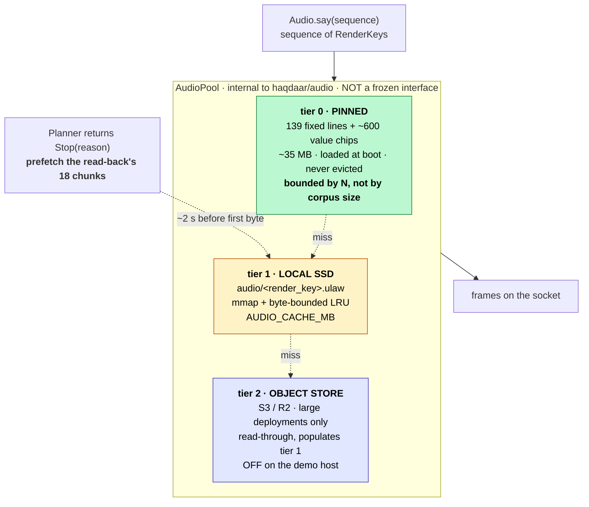

**The 50 ms budget survives because of what is in tier 0, not because of cache luck.** The split is
not by frequency, it is **by predictability**:

| Family | Size | Tier | Why |
|---|---|---|---|
| Fixed lines (`3N + 1 = 139`) | ~9 MB | **0 · pinned** | Played on an unpredictable turn boundary, with the 1.2 s clock already running. **Never allowed to miss** |
| Value chips (~600) | ~30 MB | **0 · pinned** | Same — a confirm chip follows the caller's answer immediately |
| Scheme chunks (`6 × schemes × 3`) | **the whole growth term** | **1 · lazy** | **Announced one full turn ahead.** `Planner.next_action` returns `Stop` *before* the read-back is spoken |

**Tier 0 is bounded by `N` and the value-set cardinality — both frozen numbers — so it is ~35 MB at
100 schemes and ~35 MB at 2,500.** That is the whole trick: *the part of the pool that must be
instant does not grow with the corpus, and the part that grows is never needed instantly.*

**The prefetch is the load-bearing claim.** `Stop(reason)` is the last thing the Planner does before
the read-back; between it and the read-back's first byte sit the survivor tally, the LOG line, and
the `bundle_confirm_intro` play — **~2 s of headroom against a cold NVMe read of ~18 chunks
(~0.5 MB), which is single-digit milliseconds.** A prefetch that has not landed by the time the
first chunk is due falls back to a blocking `mmap` read and is *still* inside 50 ms on local SSD;
the budget line in §9 is unchanged. **Tier 2 is never on a call's critical path** — it is a
read-through that populates tier 1, and on a deployment that enables it, `warm()` runs at snapshot
flip, not at play time.

**`Corpus.load` still raises, and still raises on the same condition.** What changes is *how it
checks*: it reads the manifest's declared key set and verifies **existence and digest** against the
pool index — a directory listing locally, a `ListObjectsV2` page at tier 2 — instead of proving the
point by reading 4.5 GB into memory. **A missing or corrupt key is still a deploy-time failure**,
which is the whole content of error rule 1. Boot cost drops from *O(corpus)* to *O(keys)*.

**Two rules this must not break, and does not.** The pool stays **one flat namespace shared across
snapshots** — tiering is a caching decision, not a layout one, and `audio/<render_key>.ulaw` is
still the path at every tier. And **one file per play call, no slicing** ([[05-DATA-CONTRACT]] §2)
holds: an `mmap` hands the socket writer a whole file's bytes, exactly as a dict lookup did.

**What the demo host actually does.** `AUDIO_CACHE_MB` defaults to a value above the demo pool, and
boot warms tier 1 — so on Adarsh's laptop **every read is already a hit and the behaviour is
byte-identical to preloading.** The tiers are latent structure that costs the demo nothing and is
the reason the same code answers a national corpus.

---

**A record failing any gate does not enter the snapshot.** No partial record, no warning flag, no
degraded read — the same rule [[tickets/T06]] set for a row that cannot be fully expressed.
[[tickets/T07]] fixes the order: *"alias floor first (cheapest, excludes most), expressibility
second, read-back completeness last, because it is the only one that spends TTS."*

### Three error rules, frozen ([[tickets/T17]] §2)

1. **`Corpus` raises at `load` and never during a call.** Every runtime read is total, because the
   gate already guaranteed it. *"A runtime KeyError would mean the gate is broken, and deploy is the
   right place to learn that — not turn four of a judged call."* **Lazy audio does not weaken this**
   — `load` verifies that every declared `render_key` **exists and hashes correctly**, which is the
   claim the rule was ever making; see §10.1. A byte-transport failure on a verified key is a
   **socket-class fault owned by `Audio`**, in the same family as the carrier dropping, and is not a
   `Corpus` error.
2. **`Log.write` never raises.** A line failing schema validation is written anyway carrying
   `invalid: true`. *"A malformed line is still evidence; a missing line is nothing."* This is the
   one place in the design where we deliberately persist something known-wrong.
3. **`Model` never raises and never returns a value outside the closed set.**

### The trace

**One JSONL per call, one line per turn, every turn, whatever its class** ([[tickets/T16]]).
**The trace explains; it does not replay** — audio is destroyed at hangup, so text reconstruction is
the whole requirement.

**Derive, don't store.** The snapshot id plus the ordered box vector reconstruct the entire call, so
masks, survivor sets, tallies and specificity are **never written**. The exceptions — written once,
at the moment they are true — are the **stop condition** and the **`ladder_rung`**, because those
are not properties of the state but *which branch the code took*, and *"re-running the algorithm
months later to find out is trusting the thing under audit to testify about itself."*

**One file, two readers** ([[tickets/T04]], [[tickets/T16]] §6): a judge walks it for terminal
state, turn count and spoken names; an engineer reads the same lines for class, box, value and span.
No summary object is written — *if it is trustworthy it is derivable, and if it is derivable it
should not be stored.*

**"Derive don't store" creates one obligation** ([[tickets/T21]]): the thing you derive from must
outlive the log that cites it. **Snapshot records and manifests are kept at least as long as any
LOG that names them** — committed to the repo, since they are small text. The audio pool
stays sweepable, because the LOG explains rather than replays and never needed the audio.
**The sweep may delete audio, never records.**

---

## 11 · Language — one path, and the language is a setting the call carries

**Nothing in the system is written per language.** There is no Hindi code path and no Marathi code
path ([[maps/wayfinder-map]]). A language is **two lists and a batch job**: ~150–200 keyword values
plus the scheme aliases, and the scheme text plus 46 fixed lines. Both are done before anyone calls.
Neither touches the code. *That is why adding a language is roughly a day, and why dropping one buys
almost nothing.*

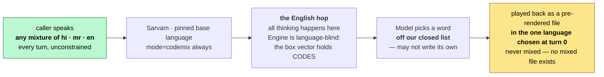

**Why the caller may mix and the system may not:** the system *chooses from a list going in* and
*reads from a file going out*. There is no mixed file and there never will be.

- **The pin is set by keypad at turn 0, and only by keypad.** Auto-detect is rejected on four
  grounds ([[tickets/T24]] §1), of which the sharpest is that **it inverts [[tickets/T03]]'s own
  finding** — pinning buys accuracy on the weakest language, while a detector on ambiguous 8 kHz
  audio biases toward the better-represented ones, *systematically degrading the Marathi caller the
  pin was protecting.* It also breaks [[tickets/T08]]'s offline test base, and leaves a wrong stamp
  with no visible cause in a design that has no confidence number anywhere.
- **Order is 1 Hindi, 2 Marathi, 3 English** — Marathi is the weakest-served caller, so clearing
  them out of the preamble ~3 s sooner is the cheapest kindness on offer. Recorded as reversible at
  zero cost; nothing downstream reads the order.
- **Invalid or no input: replay once, then default to Hindi.** The LOG records
  `lang_source: keypad | default`.
- **`*` re-pins at any moment and clears nothing** — *"a switch is the same question in different
  words."* Zero cost in every module, no new audio, no cap on switches; bounded by the 10-minute
  wall clock rather than the turn counter.
- **Code-mix bites in exactly one place, and it bites hard:** scheme names are proper nouns nobody
  translates, so **at least one of the ≥3 aliases per non-English language must be the code-mixed
  form** ([[tickets/T24]] §4). *"Three pure-Marathi aliases for PM-KISAN are three strings no caller
  will ever say."*
- **Nothing in the design may depend on the `codemix` flag existing** — what actually absorbs
  code-mixing is the English hop plus the span guard comparing against the transcript rather than
  against a vocabulary.

---

## 12 · Telephony seam — the design vocabulary is Plivo's; Twilio is an adapter

The tickets were argued against Plivo ([[tickets/T01]], [[tickets/T14]]). [[maps/wayfinder-map|Rev 25]]
suspended that **for build only**: Twilio first, behind the Audio seam; **Plivo becomes a second
adapter, not a redesign.** The translation lives in exactly one file.

| Design term ([[tickets/T14]] / [[tickets/T15]]) | Twilio wire | Plivo wire |
|---|---|---|
| play a file | send `media` (base64 μ-law, **no WAV header**), with `streamSid` | `playAudio` |
| checkpoint | send `mark` {name} immediately after the media | `checkpoint` |
| **completion signal** | receive `mark` {name} | `playedStream` |
| stop queued audio | send `clear` | `clearAudio` |
| cleared acknowledgement | receive `mark` for each queued mark — **ignore any mark cleared after a `clear`** | `clearedAudio` |
| keypad | receive `dtmf` {digit} | `dtmf` |
| caller audio | receive `media`, 20 ms μ-law frames → forward to Sarvam **unbatched** | `media` |
| call metadata | receive `start` (callSid, streamSid, customParameters) | `start` |
| end the call | receive `stop`; to hang up, close the socket — no TwiML follows `<Connect>` | REST against `callId` |

**The word "twilio" appears only under `haqdaar/audio/telephony/`.** This is a reviewable
invariant, and `docs/review` already checks it.

**The stream URL takes no query string** — per-call values go in `<Parameter>`.

Carrier flags carried from [[tickets/T14]] and [[tickets/T19]]: `bidirectional="true"`,
`audioTrack="inbound"`, `keepCallAlive="false"` (**ratify on the first real call**),
`streamTimeout="600"`, `contentType="audio/x-mulaw;rate=8000"`.

---

## 13 · Where it runs

**A demo host, and it is written down as one** ([[tickets/T19]]).

One process, one port, on Adarsh's laptop in Bengaluru. `/answer` is plain HTTP returning static XML
with no I/O; `/stream` is the WSS the carrier connects to; `/health` reports the snapshot id.
**Public HTTPS/WSS via ngrok's free plan on the account's one dev domain** — it does not change on
restart, so the carrier's Answer URL is set once and never edited again. A Cloudflare quick tunnel
was rejected for exactly the opposite property.

**Nothing is served.** Audio is pushed down the socket ([[tickets/T15]]) — no URL, no fetch, no
static host, **no object store on this host.** The snapshot records load into RAM at boot; the
rendered pool is **read lazily off local SSD** (§10.1). At demo scale the whole pool fits the cache
and is warmed at boot, so the demo host behaves exactly as before — **the tiering is what stops the
same design from breaking at national scale**, not something the demo pays for.

**The sleep rule is the one that is not deferrable.** A sleeping laptop *is* the cold start:
plugged in, lid **open**, OS sleep off for the whole demo window — lid-close sleep ignores
keep-awake utilities. **Proof, not intention:** leave it idle 30 minutes, then call. That call is
the cold-start test and it is the only one that counts.

**T20's edge is cut, not satisfied:** the laptop is in Bengaluru, which takes T20's own stall
default by construction. What remains in [[tickets/T20]] and blocks nothing: the English-hop
transcript text crosses a border to reach the model — *a data-protection question, not a carrier
rule, and it cannot produce a dead number.*

Drills, concurrency measurement and the judging freeze are in [[07-TEST-PLAN]].

---

## 14 · What is frozen, and what anyone may change

[[tickets/T17]] §6, reproduced because it is the rule that keeps the build moving.

**Frozen — needs the owners on both sides of the edge, plus a map revision:**
the four signature blocks · the per-turn LOG line schema · the snapshot layout, manifest and render
key formula · the seven-box roster and the *identity* of each closed set · the five model classes
and the three fields.

**Not frozen — the owner changes it without asking anyone:**
everything inside a module · the **contents** of the closed value sets · the wording and translation
of every fixed line and question form · voice id and TTS vendor · prompt text inside Model, so long
as the output contract holds · the widening ladder's order and the greeting's clause order.

**Every tunable in one unowned `contracts/tunables.py`, changeable by anyone, no ceremony:**
700 ms endpoint window · 1.2 s response budget · 6/6/6 silence rungs · 4 s turn-0 gap · 2.0 s model
timeout · **8-turn cap** · **6-question wall** · alias floor 3 · ≤4 survivor stop · 10-minute
ceiling · `max_source_age_days` 14. *"A number that needs a ceremony will not be changed
mid-demo"* — and [[tickets/T14]] explicitly wants `silence_duration_ms` tuned on a live stream.

**Seam disputes are arbitrated by the fixture test.** Whoever's day-one test still passes is not
holding the bug. No adjudication, no meeting.

---

## 15 · Named debts — known, dated, accepted for v1

Carried from the tickets that recorded them; tracked with owners in [[10-RISK-REGISTER]].

| Debt | Source | Why accepted |
|---|---|---|
| **No human verifies any translated string** | [[tickets/T08]] truth lock suspended | Machine-checked gates are the only defence; recorded, not repealed |
| **Facets are model-derived, not human-read** | [[tickets/T07]] rev 22 | *"Preference shall be given to women" is not "for women"* — the model may flatten it |
| **The LOG persists caller-descriptive transcripts** | [[tickets/T16]] §5 | A redacted transcript cannot evidence a CLARIFY or an UNCLEAR — which is the entire reason the field exists |
| **Transcript text crosses a border to the model** | [[tickets/T11]] · [[tickets/T20]] | Data-protection question; post-demo |
| **One machine, one uplink, no monitoring beyond the LOG** | [[tickets/T19]] | Scale ruled out at rev 2; this is its concrete shape |
| **No webhook signature validation on `/stream`** | [[tickets/T19]] | Low odds over two days; first thing after the demo |
| **Personal data at rest on a personal laptop** | [[tickets/T19]] | Full-disk encryption is the whole control |
| **Runtime holds a key that can also do TTS** | [[tickets/T19]] | One Sarvam key covers Ear and Mouth. Weakened from a credential rule to a **code rule**: the runtime imports no TTS client, and a test asserts it |
| **Judges' handsets must dial a +1 number** | [[maps/wayfinder-map]] rev 25 | Check every caller's phone beforehand |
| **One caller at a time on the free tier** | [[maps/wayfinder-map]] rev 27 | Measure it in Step 19; **announce it before judging** |
| **Sarvam Bulbul's Marathi at 8 kHz is unheard** | [[tickets/T15]] · [[tickets/T23]] | Day-one listening check; the render key makes a voice swap cheap |

---

## 16 · Related

[[01-CONTRADICTIONS]] · [[02-PRD]] · [[04-INTERFACES]] · [[05-DATA-CONTRACT]] ·
[[06-BUILD-PLAN]] · [[07-TEST-PLAN]] · [[08-TRACEABILITY]] · [[09-DECISION-LOG]] ·
[[10-RISK-REGISTER]]
[[briefs/audio]] · [[briefs/model]] · [[briefs/engine]] · [[briefs/data]]
[[maps/wayfinder-map]] · [[notes/audio/overview]] · [[notes/model/overview]] ·
[[notes/engine/overview]] · [[notes/data/overview]] · [[people/adarsh-agarwala]]

---
**Wayfinder Map:** [[maps/wayfinder-map|Latest Map]] · **Brain Index:** [[glossary|Glossary]]
