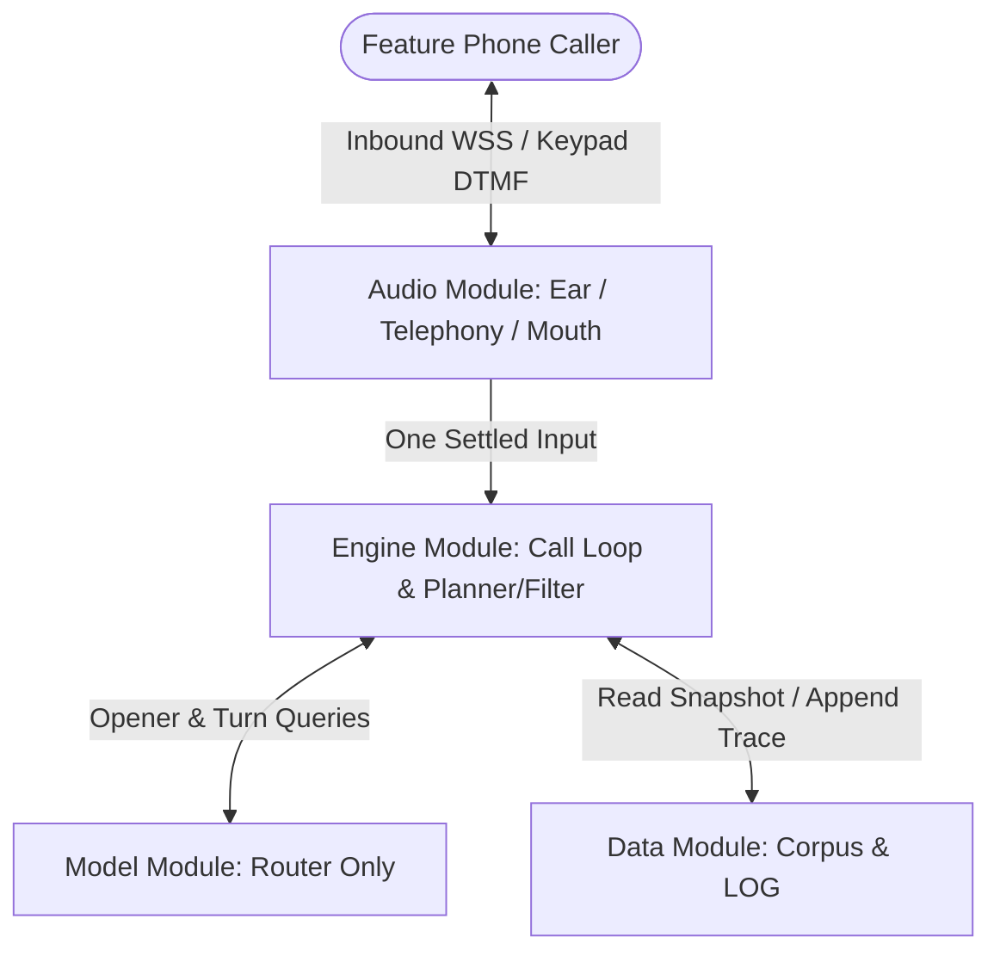

# HAQDAAR v2 System Overview

**Destination:** A complete, trusted system design package cut into four owned modules ready to build.  
**Architect:** [[people/adarsh-agarwala|Adarsh Agarwala]]  
**Current Map:** [[maps/wayfinder-map|Wayfinder Map (Rev 27)]]

---

## 1. The Acceptance Bar (Target: 14 Sep 2026)

Every technical and product decision is evaluated against this standing test:
1. **Live Telephone Inbound:** Takes real calls in **Hindi**, **English**, and **Marathi** over a **Twilio +1 number** (acceptance bar amended in Rev 25 due to Plivo KYC; Plivo retained as alternate adapter). Turn 0 keypad pins response language; code-mixing is supported on all pins ([[tickets/T24]]).
2. **Door A Under 20s:** A caller who names a scheme gets its details read back in under 20 seconds. Measured from opener `vad.speech_end` to provider `playedStream` checkpoint placed immediately before the first word of the scheme name ([[tickets/T12]], [[tickets/T14]]). Exact alias match runs in code first for 0 model cost.
3. **Door B Precision:** A caller describing their personal demographic profile gets **2 to 4 named schemes** (or an auditable dead-end ladder resolution with nearest schemes labelled honestly, [[tickets/T04]], [[tickets/T10]], [[tickets/T18]]).
4. **LOG Auditability:** The decision trace proves deterministically why each scheme was chosen via a single JSONL per call with derive-on-read replay ([[tickets/T16]]).

---

## 2. The Four Owned Modules & Architecture Seams

Ratified by [[tickets/T17]] (Rev 20) and [[docs/architecture]] (Rev 27) with single-direction dependency graph:  
`Data ← Model ← Engine`, `Audio ← Engine`. **Audio depends on nothing.**

Host: Single Python 3.11 asyncio process on laptop in Bengaluru behind ngrok dev domain ([[tickets/T19]]). Zero runtime TTS; zero static audio serving (audio streamed over WebSocket).

### [[notes/audio/overview|1. Audio Module]]
- **Components:** Inbound Telephony (Twilio `<Connect><Stream>` primary, Plivo alternate, [[tickets/T05]]), Speech Recognition (Ear via Sarvam `saaras:v3-realtime`), Mouth (`say`/`repeat`/`clear` over provider checkpoints, [[tickets/T15]]).
- **Key Invariants:** Keypad DTMF interrupts playback immediately; speech barge-in declined in favor of *listen always, interrupt only on keypad* ([[tickets/T14]]). Live TTS ceiling is **zero**; Mouth serves pre-rendered 8 kHz μ-law files from a content-addressed pool indexed by `sha256(text ‖ lang ‖ voice_id ‖ tts_model ‖ 8000)`. Fixed line inventory is 41 lines (124 clips) / 46 YAML lines ([[tickets/T18]], [[tickets/T23]]). Audio surfaces one settled `Input` and never terminates a call directly.
- **Related Tickets & Docs:** [[tickets/T01]], [[tickets/T03]], [[tickets/T05]], [[tickets/T14]], [[tickets/T15]], [[tickets/T17]], [[tickets/T19]], [[tickets/T20]], [[tickets/T23]], [[tickets/T24]], [[docs/architecture]]

### [[notes/model/overview|2. Model Module]]
- **Components:** **Router Only** (Reader eliminated by [[tickets/T17]] — read-back is pre-rendered chunks addressed by ID). Door A (Opener Name Matcher), Door B (Need Profile Extractor).
- **Key Invariants:** Door A is the opener returning a `scheme` pseudo-box; 3-field contract (`class`, `box`, `value`) with 5 classes; internal literal span guard drops hallucinations; unconditional echo-confirm on box values (Door A exempt); runs on **Groq free tier** (closed-set selection only, model ID in `tunables.py`, [[docs/architecture]]). Model never raises and never returns out-of-set values. 2 failures (including 429 rate limit) trigger call-level keypad-only mode in Engine ([[tickets/T18]]).
- **Related Tickets & Docs:** [[tickets/T04]], [[tickets/T08]], [[tickets/T11]], [[tickets/T12]], [[tickets/T12b]], [[tickets/T17]], [[tickets/T18]], [[tickets/T23]], [[tickets/T24]], [[docs/architecture]]

### [[notes/engine/overview|3. Engine Module]]
- **Components:** Call Loop Orchestrator (`run_call`, [[tickets/T17]]), Checker (Hard constraints), Filter (Retained bitmasks), Planner (Minimax question selection).
- **Key Invariants:** Engine owns the stateful call loop, but `Planner` and `Filter` are pure functions. 7-box roster (box 0 `category`, 3 hard walls, 3 soft blur); retained turn masks derive `survivors`, `tally`, and `miss-set`; soft-only widening ladder; 8-turn cap; 4th stop condition at zero survivors. Three distinct terminals (widened match, nearest capped at 2 with `summary` only, empty) with **bad-news-first** ordering lock ([[tickets/T18]]).
- **Related Tickets & Docs:** [[tickets/T06]], [[tickets/T09]], [[tickets/T10]], [[tickets/T11]], [[tickets/T13]], [[tickets/T16]], [[tickets/T17]], [[tickets/T18]], [[tickets/T23]], [[docs/architecture]]

### [[notes/data/overview|4. Data Module]]
- **Components:** Corpus Ingest Pass ([[tickets/T07]]), Immutable Snapshots, Audit LOG Trace ([[tickets/T16]]), Test Fixture Curation ([[tickets/T17]]), Provenance & Freshness Gate ([[tickets/T21]]).
- **Key Invariants:** Automated unattended ingest pass where N is a build parameter; human completely removed from ingest path (`facets_verified` retired as gate, verifier initials dropped). Four build gates: expressibility, alias floor (≥3 per language, ≥1 code-mixed for non-English), read-back completeness (18 clips per row), forbidden-phrase check ([[tickets/T18]]), and provenance/freshness check (host `myscheme.gov.in`, age $\le 14$ days, `source_sha256` drift check before freeze, [[tickets/T21]]). LOG trace explains via derive-on-read text reconstruction. Audio pool fits in ~200 MB RAM/local disk.
- **Related Tickets & Docs:** [[tickets/T02]], [[tickets/T06]], [[tickets/T07]], [[tickets/T08]], [[tickets/T15]], [[tickets/T16]], [[tickets/T17]], [[tickets/T19]], [[tickets/T20]], [[tickets/T21]], [[tickets/T22]], [[docs/architecture]]

